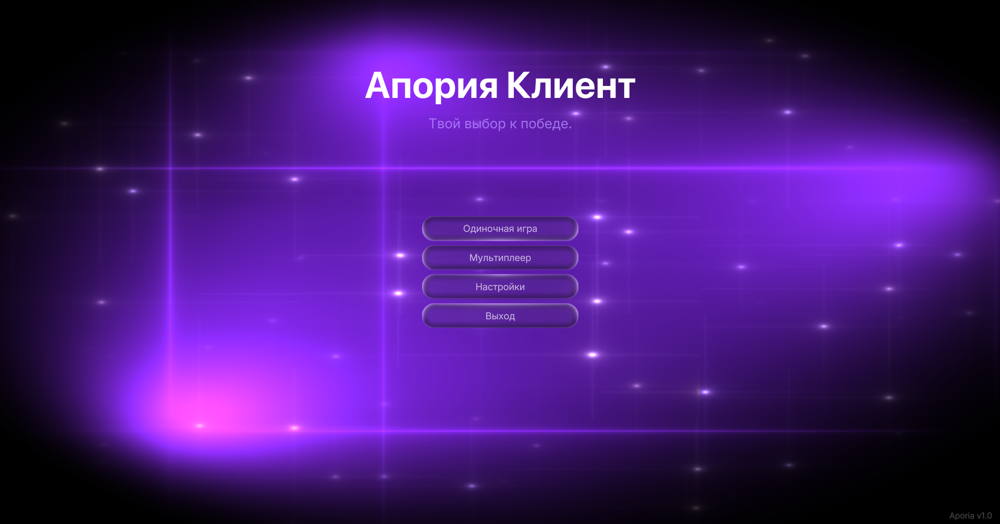

# Aporia Client


**Aporia** — современный чит-клиент для Minecraft 1.21.11+ с модульной архитектурой, GPU-ускоренным рендерингом и интеграцией Discord.

> [RU](#ru) · [EN](#en) · [中文](#cn)

---

<div id="ru"></div>

## 🇷🇺 Русский

### Возможности

- **Модульная система** — расширяемый фреймворк с управлением жизненным циклом
- **GPU-рендеринг** — SDF-шейдеры, размытие, скруглённые фигуры, хроматическая аберрация
- **ClickGui** — современный интерфейс с поиском, превью 3D-моделей и скроллом настроек
- **Aura** — серверная ротация, свободная камера, мульти-таргеты, 1.8/1.9+ режимы
- **Discord RPC** — аватар, статус, профиль в интерфейсе
- **Мультиязычность** — EN, RU, CN

### Требования

- **Java**: 26+
- **Minecraft**: 1.21.11+
- **Сборка**: `javac` напрямую, без Gradle

### Сборка

```bash
git clone <repo>
cd Aporia
javac -d build -sourcepath src --release 26 -encoding UTF-8 @find src -name "*.java"
```

### Структура

```
src/so/aporia/
├── module/          # Модули (Aura, AutoSprint, ESP...)
├── utils/
│   ├── events/      # Event bus
│   ├── packets/     # Packet interceptor
│   ├── user/
│   │   ├── rotation/  # Server rotation
│   │   ├── render/    # GPU renderer
│   │   └── locale/    # i18n (EN/RU/CN)
│   └── files/       # Config
└── aporia/cc/       # OS manager, auth
```

### Лицензия

Aporia.cc Software License Agreement v1.0 — проприетарное ПО.

---

<div id="en"></div>

## 🇬🇧 English

### Features

- **Modular system** — extensible framework with lifecycle management
- **GPU rendering** — SDF shaders, blur, rounded shapes, chromatic aberration
- **ClickGui** — modern UI with search, 3D model preview, scrollable settings
- **Aura** — server-side rotation, free camera, multi-targets, 1.8/1.9+ modes
- **Discord RPC** — avatar, status, profile in UI
- **Multi-language** — EN, RU, CN

### Requirements

- **Java**: 26+
- **Minecraft**: 1.21.11+
- **Build**: `javac` directly, no Gradle

### Build

```bash
git clone <repo>
cd Aporia
javac -d build -sourcepath src --release 26 -encoding UTF-8 @find src -name "*.java"
```

### Structure

```
src/so/aporia/
├── module/          # Modules (Aura, AutoSprint, ESP...)
├── utils/
│   ├── events/      # Event bus
│   ├── packets/     # Packet interceptor
│   ├── user/
│   │   ├── rotation/  # Server rotation
│   │   ├── render/    # GPU renderer
│   │   └── locale/    # i18n (EN/RU/CN)
│   └── files/       # Config
└── aporia/cc/       # OS manager, auth
```

### License

Aporia.cc Software License Agreement v1.0 — proprietary software.

---

<div id="cn"></div>

## 🇨🇳 中文



### 功能

- **模块化系统** — 可扩展的框架，具有生命周期管理
- **GPU 渲染** — SDF 着色器、模糊、圆角形状、色差
- **ClickGui** — 现代 UI，支持搜索、3D 模型预览、可滚动设置
- **Aura** — 服务器端旋转、自由相机、多目标、1.8/1.9+ 模式
- **Discord RPC** — 头像、状态、UI 中的个人资料
- **多语言** — EN, RU, CN

### 要求

- **Java**: 26+
- **Minecraft**: 1.21.11+
- **构建**: 直接使用 `javac`，无需 Gradle

### 构建

```bash
git clone <repo>
cd Aporia
javac -d build -sourcepath src --release 26 -encoding UTF-8 @find src -name "*.java"
```

### 项目结构

```
src/so/aporia/
├── module/          # 模块 (Aura, AutoSprint, ESP...)
├── utils/
│   ├── events/      # 事件总线
│   ├── packets/     # 数据包拦截器
│   ├── user/
│   │   ├── rotation/  # 服务器端旋转
│   │   ├── render/    # GPU 渲染器
│   │   └── locale/    # 国际化 (EN/RU/CN)
│   └── files/       # 配置文件
└── aporia/cc/       # 操作系统管理，认证
```

### 许可证

Aporia.cc 软件许可协议 v1.0 — 专有软件。

---

**Version**: 0.5-dev  
**Minecraft**: 1.21.11  
**Java**: 26+  
**Status**: Active development
